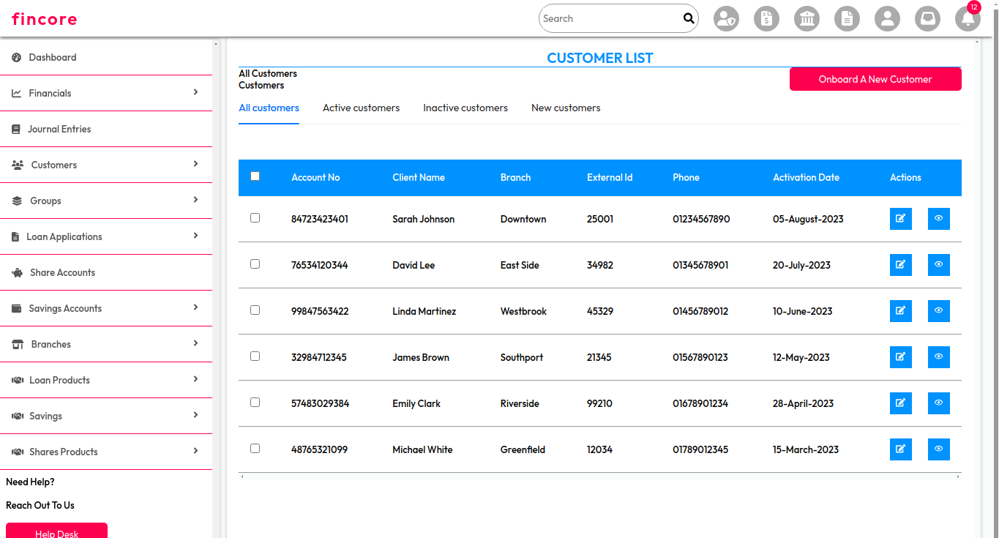
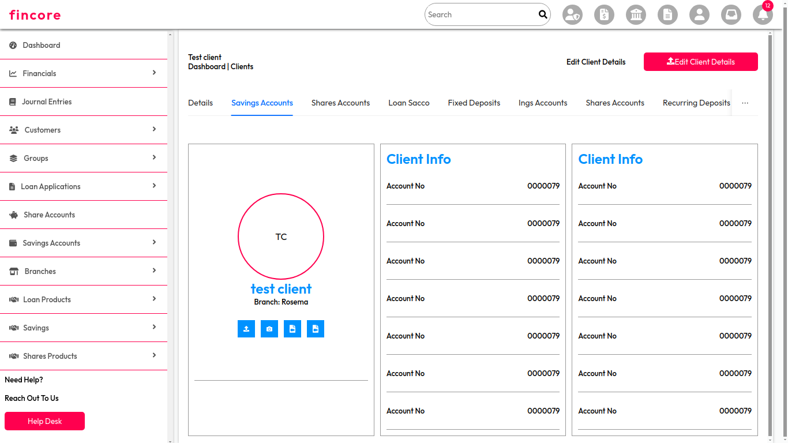
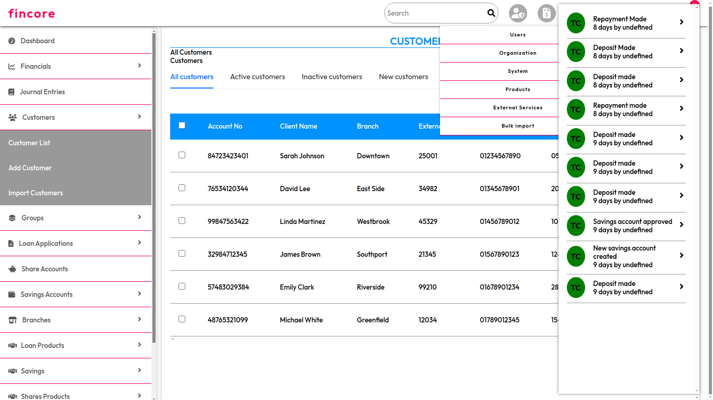
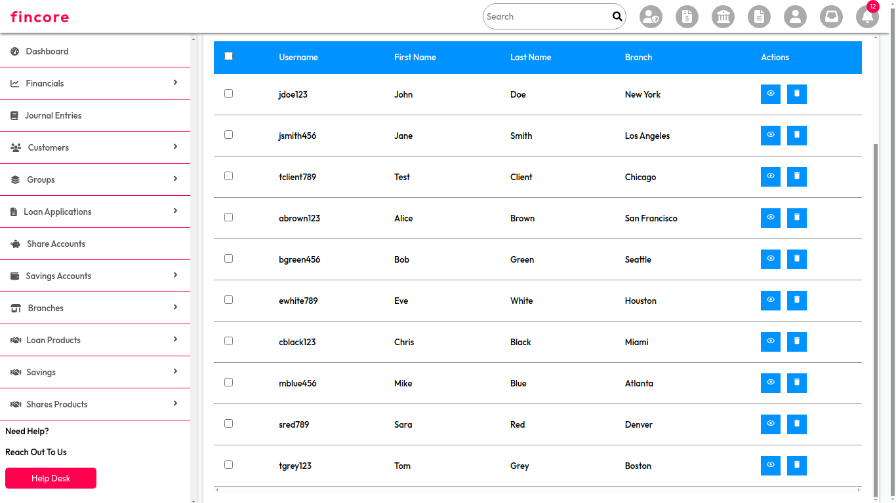

# Financial Dashboard

This project is a **complex financial dashboard** designed to visualize and manage financial data using **Redux Toolkit**, **CSS**, **Ant Design (AntD)**, and **React Icons** for the user interface. The dashboard is built with a modern, sleek design, and it focuses on providing clear and insightful financial data visualizations and analytics.

### `SCREEN 1`



### `SCREEN 2`



### `SCREEN 3`



### `SCREEN 4`



## Features

- **State Management**: The application state is efficiently managed using **Redux Toolkit**, ensuring a scalable and maintainable structure.
- **UI Components**: Leveraged **Ant Design (AntD)** for a responsive, professional-looking user interface, focused on usability and clean design principles.
- **Icons**: **React Icons** are used to improve user experience, providing intuitive and meaningful iconography throughout the dashboard.
- **Custom Styling**: Utilized **CSS** for fine-tuning the appearance, allowing for a polished and visually appealing dashboard.

## Project Link

[GitHub Repository](https://github.com/Ritahchanger/dashboards/tree/main/dashboard1)

Check out the project repository for the full source code and detailed instructions on how to set up and run the project.

## Technologies Used

- **React**: Frontend framework for building the user interface.
- **Redux Toolkit**: For efficient state management across the application.
- **Ant Design (AntD)**: For providing a professional and responsive UI design.
- **CSS**: Custom styles to ensure a polished look and feel.
- **React Icons**: For intuitive and meaningful iconography.

## Live Version

Explore the live version of the dashboard here:  
[Live Dashboard](https://dashboards-psi.vercel.app/fintec/dashboard)

## How to Run the Project

1. Clone the repository:

   ```bash
   git clone https://github.com/Ritahchanger/dashboards.git
   cd dashboards/dashboard1
   ```

### `Inside frontend folder`

- run `npm install`
- run `npm run start`
